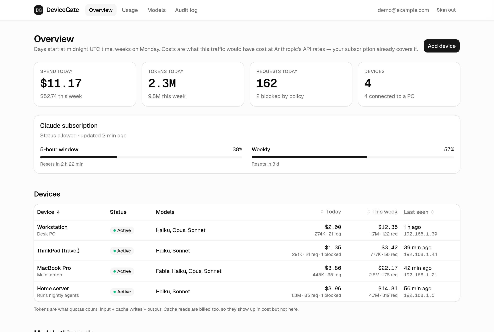
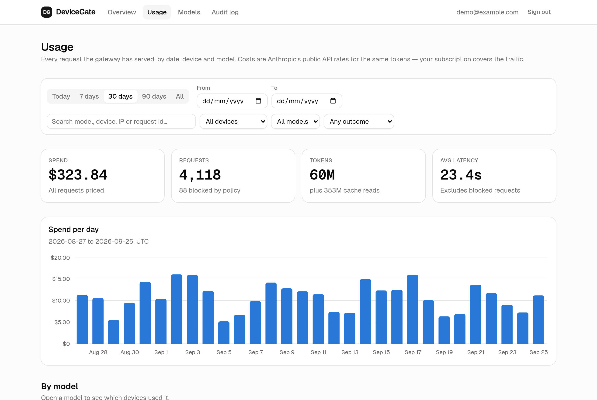
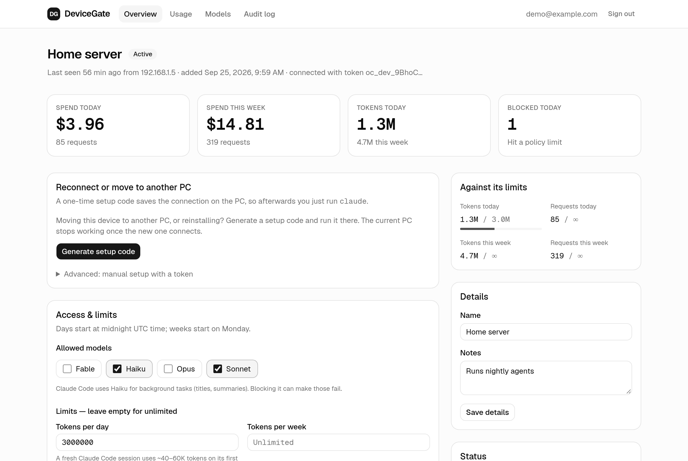
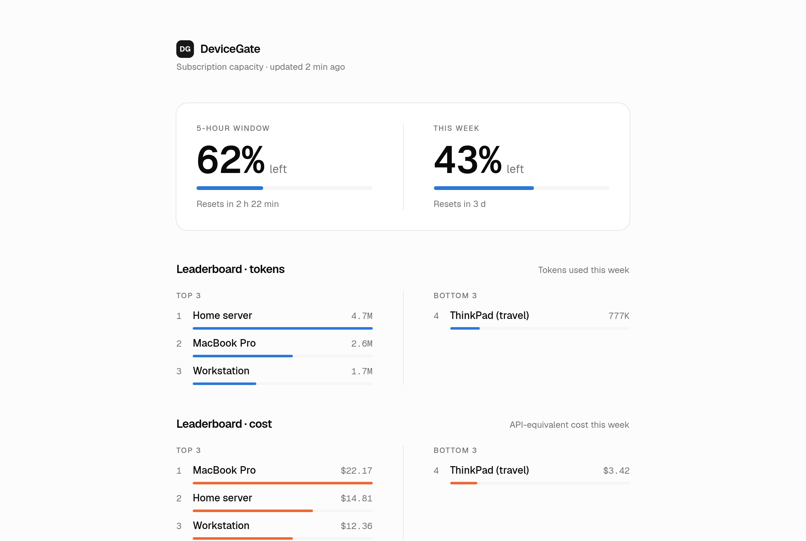

# DeviceGate

[](https://github.com/jkugsiya/DeviceGate/actions/workflows/ci.yml)
[](LICENSE)

**A self-hosted gateway that gives each of your machines its own key, model access, limits and
usage history for Claude Code, all on your one Claude subscription.**

Your Claude login stays on a single machine on your LAN. Every other PC connects through DeviceGate
with its own revocable device token. You decide which models each one may use and how much, and you
can see exactly where your subscription's capacity went.

```text
your PCs ──(device token)──► DeviceGate :3000 ──► TeamClaude :3456 (holds your Claude login) ──► Anthropic
```



> [!IMPORTANT]
> DeviceGate is for **your own machines on your own subscription**. Don't use it to share a Claude
> plan with other people. See [Terms of use](#terms-of-use).
>
> DeviceGate is an independent project. It isn't affiliated with or endorsed by Anthropic. "Claude"
> and "Claude Code" are trademarks of Anthropic, PBC.

## Why

Once Claude Code runs on more than one of your machines (a laptop, a desktop, an always-on box
running agents), they all draw from one shared 5-hour and weekly allowance, and you can't see which
one used it. DeviceGate gives you:

- **One login, many machines.** The subscription credential lives only on the gateway machine. Each
  PC holds its own device token, which you can revoke from the admin at any time.
- **Two-minute device setup.** Add a device in the admin and run the one-line command it shows on
  the PC (macOS, Linux or Windows). After that, plain `claude` works.
- **Per-device model access.** Allow Opus on your workstation and only Haiku on the automation box.
  Models match by family prefix, so new model versions are covered without code changes.
- **Per-device limits.** Daily and weekly request and token quotas, requests per minute, and
  concurrent requests. When a limit is hit, Claude Code shows a readable error with the reset time.
- **Usage and cost tracking.** Input, output and cache tokens for every request, plus what they
  would have cost at API rates. Break it down by device, model and day, filter it, and bookmark or
  share the view as a URL.
- **Subscription capacity at a glance.** The remaining 5-hour and weekly utilization, read from
  Anthropic's own response headers.
- **Audit log.** Every admin action and sign-in attempt, with before/after diffs.
- **Private by design.** Prompts and responses are never stored. Tokens and setup codes are kept
  only as hashes.
- **Small.** One Next.js process and one SQLite file. No Redis, Postgres or Docker required.

| Usage explorer | Device limits |
| --- | --- |
|  |  |

## Terms of use

Read this before deploying.

- **DeviceGate is built for one person and their own devices.** Anthropic's
  [Consumer Terms](https://www.anthropic.com/legal/consumer-terms) and the
  [Claude Code legal and compliance page](https://code.claude.com/docs/en/legal-and-compliance)
  don't allow routing other people's requests through your Free, Pro or Max credentials. They also
  state that advertised plan limits assume ordinary, individual use.
- **Never give a device token to anyone else**, whether coworkers, family, clients or customers. If
  several people need Claude Code, each should sign in with their own subscription, or your
  organization should use a Team/Enterprise plan or API keys from the
  [Claude Console](https://platform.claude.com/).
- Claude sign-in is handled by [TeamClaude](https://github.com/KarpelesLab/teamclaude) through
  Anthropic's own OAuth flow. DeviceGate never sees your Claude password or OAuth tokens.
- Anthropic may enforce these terms without notice. Deciding whether your setup complies is your
  responsibility. Nothing here is legal advice.

## How it works

1. You sign in to your Claude account once, with TeamClaude, on the gateway machine. TeamClaude
   listens only on `127.0.0.1`.
2. DeviceGate runs next to it on your LAN. It authenticates each PC's device token and applies that
   device's model allow-list and limits. It then forwards the request to TeamClaude with the only
   credential it holds.
3. Responses stream back unchanged. As they pass through, DeviceGate reads the token usage out of
   the stream and records it.

Claude Code needs no patches. The setup script only sets `ANTHROPIC_BASE_URL` and
`ANTHROPIC_AUTH_TOKEN` in the PC's `~/.claude/settings.json`. For the full design (request
pipeline, data model, security model), see [docs/architecture.md](docs/architecture.md).

## Requirements

- **A gateway machine:** Linux or macOS, always on, with a fixed LAN IP (reserve it in your router).
- **Node.js ≥ 20.9**, **[Bun](https://bun.sh)** and git on the gateway machine.
- **A Claude subscription** (Pro or Max).
- **Client PCs:** macOS, Linux or Windows with [Claude Code](https://code.claude.com) installed.

## Quick start

**1. Get the code.**

```sh
git clone https://github.com/jkugsiya/DeviceGate.git
cd DeviceGate
bun install
```

**2. Sign TeamClaude in to your Claude account, then start it.**

```sh
bun add -g @karpeleslab/teamclaude     # or: npm install -g @karpeleslab/teamclaude
teamclaude login                        # choose 1 (Claude subscription), finish in the browser
teamclaude server --headless            # keep this running (see "Run as a service")
```

**3. Configure DeviceGate.**

```sh
bun run init-env                  # or pass the LAN IP: bun run init-env 192.168.1.50
```

This writes `.env.local` with TeamClaude's key, a fresh auth secret, the gateway's LAN URL and your
timezone. It won't overwrite an existing file unless you add `--force`. See
[Configuration](#configuration) for each value.

**4. Create your admin login.** You'll be asked for a password of at least 12 characters.

```sh
bun run admin create you@example.com "Your Name"
```

**5. Build and start.**

```sh
bun run build
bun run start      # serves on 0.0.0.0:3000; the database is created and migrated on start
```

**6. Allow port 3000 from your LAN** if a firewall is on. For example,
`sudo ufw allow from 192.168.0.0/16 to any port 3000 proto tcp`, or with firewalld,
`sudo firewall-cmd --permanent --add-port=3000/tcp && sudo firewall-cmd --reload`.

**7. Connect your PCs.** Open `http://<gateway-ip>:3000/admin`, sign in and click **Add device**. The
page shows a one-time setup code and the exact command to run on that PC:

```sh
# macOS / Linux
curl -fsSL http://<gateway-ip>:3000/setup.sh | sh -s -- K7QM-2XPA
```

```powershell
# Windows (PowerShell)
& ([scriptblock]::Create((irm http://<gateway-ip>:3000/setup.ps1))) K7QM-2XPA
```

Codes are single-use and expire after 15 minutes. After that, plain `claude` on that PC goes
through the gateway.

> [!WARNING]
> DeviceGate serves plain HTTP and is meant for your LAN. **Don't expose port 3000 to the
> internet.** To reach it from elsewhere, use a VPN such as [Tailscale](https://tailscale.com), or
> put a TLS reverse proxy in front and restrict who can reach it.

## Configuration

Everything is set in `.env.local`. [`.env.example`](.env.example) documents the same values.

| Variable | Required | Description |
| --- | --- | --- |
| `UPSTREAM_API_KEY` | yes | TeamClaude's `proxy.apiKey`, from `~/.config/teamclaude.json`. |
| `UPSTREAM_URL` | no | TeamClaude's address. Default `http://127.0.0.1:3456`. Keep it on loopback. |
| `BETTER_AUTH_SECRET` | yes | Signs admin sessions. Generate with `openssl rand -base64 32`. |
| `BETTER_AUTH_URL` | yes | The gateway's LAN URL, e.g. `http://192.168.1.50:3000`. |
| `ADMIN_TRUSTED_ORIGINS` | yes | Comma-separated origins you open the admin from. |
| `DATABASE_PATH` | no | SQLite file. Default `./data/gateway.db`. |
| `TIMEZONE` | no | IANA zone for quota windows and admin times, e.g. `Europe/Berlin`. Days start at local midnight and weeks on Monday. Default: the server's zone. |
| `GATEWAY_PUBLIC_URL` | no | The URL written into each device's `ANTHROPIC_BASE_URL`. Defaults to `BETTER_AUTH_URL`. |

## Run with Docker

DeviceGate can run in a container instead of steps 5 and 6 of the Quick start. TeamClaude still
runs on the host (steps 1 and 2), because it holds your Claude login and listens only on
`127.0.0.1`. The container uses host networking to reach it, which works on Linux, or on Docker
Desktop with host networking turned on.

```sh
bun run init-env                  # writes .env.local, as in step 3
docker compose up -d --build
docker compose exec -it devicegate bun run admin create you@example.com "Your Name"
```

The database lives in the `devicegate-data` volume, and migrations run on start. To update, run
`git pull && docker compose up -d --build`. To move the database to another machine, stop the
container and copy it out with `docker compose cp devicegate:/app/data ./data`.

## Run as a service

On Linux, systemd user services keep both processes running across reboots.

`~/.config/systemd/user/teamclaude.service`:

```ini
[Unit]
Description=TeamClaude
[Service]
ExecStart=%h/.bun/bin/teamclaude server --headless
Restart=on-failure
[Install]
WantedBy=default.target
```

`~/.config/systemd/user/devicegate.service` (adjust `WorkingDirectory`):

```ini
[Unit]
Description=DeviceGate
After=teamclaude.service
[Service]
WorkingDirectory=%h/DeviceGate
ExecStart=/usr/bin/env bun run start
Restart=on-failure
[Install]
WantedBy=default.target
```

```sh
systemctl --user daemon-reload
systemctl --user enable --now teamclaude devicegate
sudo loginctl enable-linger $USER     # keep them running while you're logged out
```

On macOS, a `launchd` agent with the same two commands does the job.

## Updating

```sh
git pull && bun install && bun run build
systemctl --user restart devicegate
```

Pending database migrations and any missing request costs are applied on startup, so a restart is
all an update needs. Watch it come up with `journalctl --user -u devicegate -n 30`.

## Day to day

| Task | How |
| --- | --- |
| Add or reconnect a PC | Admin → **Add device**, or device page → **Generate setup code** |
| Set models and limits for a PC | Device page → **Access & limits** |
| Block a PC right now | Device page → **Disable device** |
| See who did what | Admin → **Audit log** |
| See where the capacity went | Admin → **Usage** |
| See which PCs used a model | Admin → **Usage** → click the model |
| Usage between two dates | Admin → **Usage** → **From / To** |
| Reset the admin password | `bun run admin password you@example.com` |
| Manage devices from the shell | `bun run device list \| create <name> \| setup <id> \| disable <id> \| …` |
| Re-price past requests | `bun run recompute-costs` (after editing `lib/pricing.ts`) |

### Usage explorer

`/admin/usage` is the tracking view. Pick a preset range or explicit **From / To** dates, narrow by
device, model or outcome, or search across model id, device name, client IP and request id. Every
table sorts by its headers, and the request log pages through the whole filtered set. All of it
lives in the URL, so any view is a link you can bookmark.

Outcomes are split three ways. **Blocked** means DeviceGate refused the request (it never reached
Anthropic). **Upstream error** means it reached Anthropic and failed there. **Succeeded** is
everything else.

### Cost tracking

Each request records input, output, cache-write and cache-read tokens, plus an **API-equivalent**
cost: what those tokens would have cost at Anthropic's pay-as-you-go rates. Your subscription
already covers this traffic, so nothing is billed. The figure is there to compare devices and spot
one burning through your quota.

Rates live in [`lib/pricing.ts`](lib/pricing.ts). Costs are computed when a request is recorded, so
old rows keep the rate that applied at the time. After changing a rate, or adding a model the admin
flags as "no price", run `bun run recompute-costs`.

### Status page



`/` needs no login. It shows the subscription capacity left in the current 5-hour and weekly
windows, tokens and API-equivalent cost all time and today, a chart of either over the last 24
hours (by hour) or 7, 30, 90 days or all time (by day), and this week's devices ranked by tokens and
by cost. Only device **names** and totals appear there (`lib/public-queries.ts` selects nothing else). If the gateway can be reached beyond
your LAN, restrict `/` at your reverse proxy.

## Moving to a new gateway machine

- **To keep devices, usage, admins and the audit log:** stop the old gateway, then copy
  `data/gateway.db` (plus `gateway.db-wal` / `-shm` if present) into `data/` on the new machine
  before starting it. Copy `BETTER_AUTH_SECRET` too if you want admin sessions to survive. Update
  the IP values in `.env.local`.
- **Each PC still points at the old IP.** On each device page, click **Generate setup code** and run
  the command on that PC again.
- Run only one DeviceGate and one TeamClaude at a time. Counters live in memory, so a second
  instance would enforce limits on its own.

## FAQ

**Do the per-device token numbers match my subscription usage?** Not exactly. Anthropic doesn't
publish how subscription usage is weighted, so DeviceGate shows its own per-device token counts and
Anthropic's reported 5-hour and weekly utilization **separately**. Cache reads are tracked but don't
count toward DeviceGate's token quotas, because long sessions would otherwise burn quota almost
entirely on them.

**A request went over the limit. Is that a bug?** No. Quotas are checked before each request,
against usage so far, so a single request can overshoot a limit.

**Claude Code updated and requests started failing.** In token mode, Claude Code leaves out two
beta flags that the subscription upstream needs, and DeviceGate adds them back
([`lib/proxy/betas.ts`](lib/proxy/betas.ts)). If a Claude Code release changes this, see
[Protocol notes](docs/architecture.md#protocol-notes) for how to check, and please open an issue.

**Can I run it in Docker or on Windows?** Docker, yes: see [Run with Docker](#run-with-docker).
A Windows gateway isn't packaged yet (Windows PCs work fine as clients). The gateway is tested on
Linux. Contributions are welcome.

## Contributing

Issues and pull requests are welcome. Start with [CONTRIBUTING.md](CONTRIBUTING.md). To report a
vulnerability, follow [SECURITY.md](SECURITY.md) and please don't open a public issue.

## Acknowledgements

[TeamClaude](https://github.com/KarpelesLab/teamclaude) by Karpeles Lab does the hard upstream work:
OAuth, token refresh and rate-limit handling. DeviceGate is built on top of it.

## License

[MIT](LICENSE) © Jayesh Kugsiya
